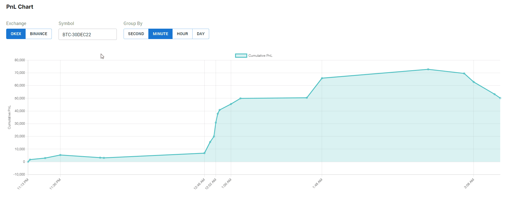

<div align="center">
  
</div>
<p>

<div align="center"><p>
<h1>Pattern Research Assignment</h1>


</div>

# Table of Contents
- [Backend](#backend)
- [Frontend](#frontend)

# Backend

To deploy the backend in `development` environment, run the following commands:

```bash
cd backend
# can skip `npm install` if the dependencies are already installed
npm install
npm run run-dev
```

# Frontend

To deploy the frontend in `development` environment and in 'watch mode', run the following commands:

```bash
cd frontend
# can skip `npm install` if the dependencies are already installed
npm install
npm run dev
```

# Simultaneously for Local Development

```bash
bash start.sh
```

Press `CTRL+C` to kill both processes.

## Demo for Frontend

<div align="center"></img></div>
